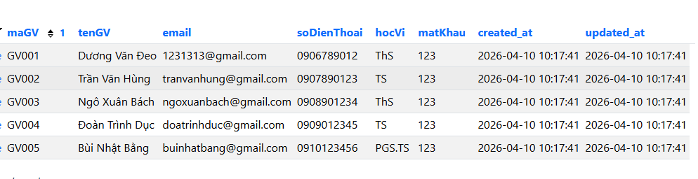
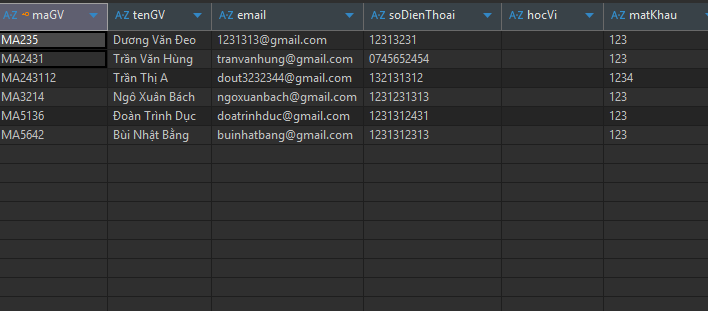

# Quản lý luận văn tốt nghiệp

## Thành viên

| MSSV       | Họ tên           | Lớp     |
| ---------- | ------------------ | -------- |
| DH52111470 | Lê Tiến Phát    | D22_TH01 |
| DH52200332 | Nguyễn Tuấn Anh  | D22_TH08 |
| DH52201225 | Võ Thiên Phú    | D22_TH08 |
| DH52200887 | Trần Quốc Khánh | D22_TH15 |
| DH52201264 | Hồ Khôi Phục    | D22_TH15 |
| LT05250031 | Siêu Ngọc Tài   | L25_TH01 |

## Phân công cv

| STT | Thành viên                 | Vai trò | Module/Controller/Trang phụ trách                                                                                               |
| --- | ---------------------------- | -------- | --------------------------------------------------------------------------------------------------------------------------------- |
| 1   | **Trần Quốc Khánh** | Backend  | AuthController, GiangVienController, phân quyền, CauHinhController, các API                                               |
| 2   | **Lê Tiến Phát**    | Backend  | DeTaiController, SinhVienController, KyLvtnController, xây dựng DB                                                    |
| 3   | **Siêu Ngọc Tài**   | Backend  | Tinh chỉnh DB, migration, seed, docker, deploy, TopicRegistrationFormController, module import file, kiểm tra & fix lỗi        |
| 4   | **Nguyễn Tuấn Anh**  | Frontend | Trang: LoginPage, TongQuan, GiangVien, NhapLieu, hỗ trợ responsive                                                             |
| 5   | **Võ Thiên Phú**    | Frontend | Trang: PhanCong, SinhVien, GiuaKy, hỗ trợ responsive (cho toàn bộ)                                                            |
| 6   | **Hồ Khôi Phục**    | Frontend | Search/ filter, phân trang, test thao tác, fix bug, tinh chỉnh style & tối ưu hiển thị dữ liệu của bảng, import file |

- Lưu ý, cả BE và FE phải push kèm file ``.env.example`` và bổ sung nội dung cho file ``readme.md`` trong BE hoặc FE

## Cấu trúc dự án

- `backend/`: Laravel API.
- `frontend/`: Giao diện người dùng.

## Thông tin chi tiết

- Backend: xem [backend/README.md](backend/readme.md)
- Frontend: xem [frontend/README.md](frontend/readme.md)

## Chạy nhanh local

Backend:

```bash
cd backend
cp .env.example .env
composer install
php artisan key:generate
php artisan migrate
php artisan serve --port=8000
```

## Backend

- API base URL: `http://127.0.0.1:8000/api` (chỉ test trên local)
- Trong môi trường mạng `https://quanly-luanvan-tn-backend-ae78.onrender.com`
- Link BE dự phòng: `https://quanlyluanvantnbackend-production.up.railway.app`

## Frontend

- Link frontend: `https://quan-ly-luan-van-tn.vercel.app`

## Thông tin tài khoản test (V2)



## Thông tin tài khoản test (V1)


